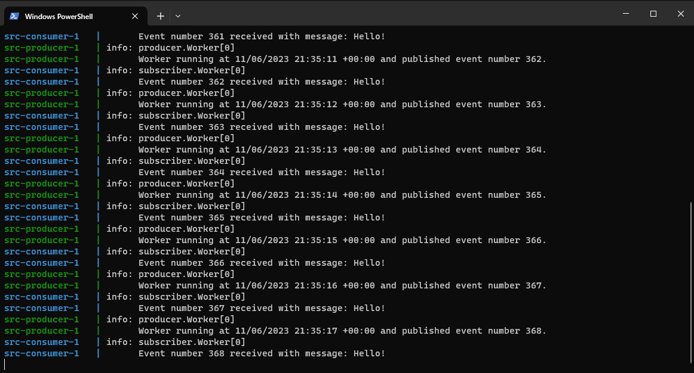

# Challenge 2

Create a service that publish events to a Kafka topic. Create another service that reads events from Kafka. Host all of it in AKS.

# Tools
We need Docker Desktop 
```powershell
 winget install Docker.DockerDesktop
```

# Run Kafka locally

I use [Strimzi Kafka](https://strimzi.io/).

It consist of two containers zookeeper and kafka. 
Create a docker-compose.yaml file:

```dockerfile
version: '2'

services:

  zookeeper:
    image: quay.io/strimzi/kafka:0.37.0-kafka-3.5.1
    command: [
        "sh", "-c",
        "bin/zookeeper-server-start.sh config/zookeeper.properties"
      ]
    ports:
    - "2181:2181"
    environment:
      LOG_DIR: /tmp/logs

  kafka:
    image: quay.io/strimzi/kafka:0.37.0-kafka-3.5.1
    command: [
      "sh", "-c",
      "bin/kafka-server-start.sh config/server.properties --override listeners=$${KAFKA_LISTENERS} --override advertised.listeners=$${KAFKA_ADVERTISED_LISTENERS} --override zookeeper.connect=$${KAFKA_ZOOKEEPER_CONNECT}"
    ]
    depends_on:
    - zookeeper
    ports:
    - "9092:9092"
    environment:
      LOG_DIR: "/tmp/logs"
      KAFKA_ADVERTISED_LISTENERS: PLAINTEXT://localhost:9092
      KAFKA_LISTENERS: PLAINTEXT://0.0.0.0:9092
      KAFKA_ZOOKEEPER_CONNECT: zookeeper:2181
```

And start the two containers with:

```powershell
cd src
docker-compose up
``` 

This starts both containers. Kafka is now accessible externally from `localhost:9092`. 

# Create Publisher Service

The worker template is used to publish an event every second.

```powershell
dotnet new solution --name challenge1
dotnet new worker --name producer
dotnet sln add producer
```

For the Kafka client I use the Confluent.Kafka nuget package. 
It is described [here](https://docs.confluent.io/kafka-clients/dotnet/current/overview.html).

```powershell
cd producer
dotnet add package Confluent.Kafka
```

I only added a bit of code to the [worker](src/producer/Worker.cs) class.

# Create Consumer Service

```powershell
dotnet new worker --name consumer
dotnet sln add consumer
```

I use the same nuget package as above and use the consumer example described [here](https://docs.confluent.io/kafka-clients/dotnet/current/overview.html). 


```powershell
cd consumer
dotnet add package Confluent.Kafka
```

I added the consumer logic to the [worker](src/consumer/Worker.cs) class. 

The GroupId property is interesting from a Kafka perspective. When an event is processed, the Kafka server is informed (automatically or with with `.Commit(...)`) that this GroupId has processed the event. When restarting the application the Kakfa server can then inform the client from what offset to continue. If the application is restarted with a different GroupId then all events is reprocessed. 

# Create Containers for services and run locally

Create `Dockerfile` files with inspiration from [here](https://learn.microsoft.com/en-us/dotnet/core/extensions/cloud-service?pivots=cli):
* [Dockerfile](src/producer/Dockerfile) for producer.
* [Dockerfile](src/consumer/Dockerfile) for consumer.

Update [docker-compose.yaml](docker-compose.yaml) with reference to the two containers (and change the 'KAFKA_ADVERTISED_LISTENERS' setting). Here the producer:

```dockerfile
producer:
    build: ./producer/
    depends_on:
    - kafka
    environment:
      "KafkaHost": "kafka:9092"
```

The `build` command points to a folder with a `Dockerfile` and builds the container when needed.  
`environment` sets environment variables and the c# application check the environment variable before `appsettings.json`. 

Start all 4 containers with 
```powershell
docker-compose up
```
And the consumer receives the messages send from the producer:



# Create ACR and AKS 

# Deploy Kafka and Services 
